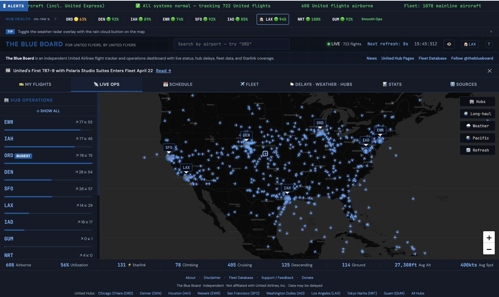

# ✈️ The Blue Board

**An unofficial, real-time operations dashboard for United Airlines — built by flyers, for flyers.**

**[→ Live Dashboard](https://theblueboard.co)** · **[📋 Changelog](CHANGELOG.md)** · **[🎨 Design System](DESIGN.md)** · **[☕ Support the Project](https://buymeacoffee.com/notjbg)** · **[💡 Suggest a Feature](https://github.com/notjbg/the-blue-board/issues)** · **[𝕏 Follow @theblueboard](https://x.com/theblueboard)**



---

## What Is This?

The Blue Board is a fan-built operations dashboard that lets you see United Airlines like an ops center would — live flight positions, hub schedules, fleet data, delays, weather, and stats, all in one dark, data-dense interface.

**Not affiliated with United Airlines, Inc.** This is an independent project by an aviation enthusiast.

---

## Features

### 📡 [Live Ops](https://theblueboard.co#live)
Real-time map tracking 600+ United flights, updated every 30 seconds. Filter by hub, toggle longhaul routes, overlay NEXRAD weather radar. Hub status sidebar shows departure/arrival counts and identifies the busiest hub. Search any flight by number, tail, or route. Great circle route lines show flight paths with city names.

### ⚠️ IROPS Monitor + AI Delay Prediction
Server-side disruption scoring across all 9 hubs — cancellations, delays (30m/60m), diversions, and FAA ground stops. **AI-powered delay risk engine** uses 8 signals (actual delay, FAA programs, weather, hub OTP, time-of-day, inbound aircraft, hub risk profile) to score delay risk 0–100. Click any risk badge for a **natural language AI explanation** powered by Claude. Preloaded automatically on page load with 5-minute server-side caching.

### 📅 [Schedule](https://theblueboard.co#schedule)
Departure and arrival boards for all 9 UA hubs (ORD, DEN, IAH, EWR, SFO, IAD, LAX, NRT, GUM). Filter by status or aircraft type. Equipment swap detection flags when a plane type changes. On-time performance stats. All times in airport-local timezone.

### ✈️ [Fleet](https://theblueboard.co#fleet)
Complete database of 1,078+ mainline aircraft — searchable and sortable by type, registration, seat config, WiFi, and IFE. Starlink tracker for 258+ equipped aircraft with sortable columns and filters by fleet, type, and operator. Live fleet status correlates airborne flights with the database. **19 dedicated fleet type pages** ([737 MAX 9](https://theblueboard.co/fleet/737-max-9), [A321neo](https://theblueboard.co/fleet/a321neo), [787-9](https://theblueboard.co/fleet/787-9-dreamliner), etc.) with full aircraft registries, structured data, and cross-type navigation.

### 🌦 [Delays · Weather · Hubs](https://theblueboard.co#weather)
FAA NAS delay and ground stop alerts, METAR observations with plain-English explainers, NEXRAD radar overlay, and hub health indicators. Each hub gets a unified card with conditions, visibility, wind, ceiling, and current delay status. **Ops Impact Assessment** goes beyond standard flight categories to flag real operational risks — snow, gusts, freezing precipitation, thunderstorms — even when conditions are technically VFR. Radar map renders instantly; weather data loads in parallel via batched API calls.

### 📊 [Stats](https://theblueboard.co#stats)
Live fleet utilization by aircraft type (airborne vs. total), flight phase distribution (climb/cruise/descent donut chart), hub-to-hub traffic flow matrix, top active routes, fleet delivery timeline with stacked histogram colored by aircraft family, and Starlink coverage metrics. All live data updates every 30 seconds.

### 🔍 Flight Search
Look up any UA flight number from the header search bar. Returns live position, route, aircraft details, and scheduled/actual times via the official Flightradar24 API.

### 🏢 [Hub Pages](https://theblueboard.co/hubs/ord)
Dedicated SEO-rich pages for each of United's 9 hubs ([ORD](https://theblueboard.co/hubs/ord) · [DEN](https://theblueboard.co/hubs/den) · [IAH](https://theblueboard.co/hubs/iah) · [EWR](https://theblueboard.co/hubs/ewr) · [SFO](https://theblueboard.co/hubs/sfo) · [IAD](https://theblueboard.co/hubs/iad) · [LAX](https://theblueboard.co/hubs/lax) · [NRT](https://theblueboard.co/hubs/nrt) · [GUM](https://theblueboard.co/hubs/gum)). Each page includes live flight counts, hub overview with terminal/concourse details, United Club and Polaris lounge locations, delay pattern analysis by season, Starlink WiFi info, construction alerts with links to official project pages, structured FAQ, and FAQPage + Airport schema markup for search engines. Jump navigation and scroll hints guide visitors through the content.

### 📰 [News](https://theblueboard.co/news)
Curated United Airlines news hub with individual article pages, source links, and cross-links to related hub and fleet pages via tags. Google News sitemap and dynamic RSS feed for indexing. "Latest News" banner on the dashboard links to the newest article. Optional email digest via Resend Broadcasts notifies waitlist subscribers of new articles.

### More
- **AI delay risk scoring** — 8-signal algorithm considers weather, FAA programs, hub OTP, inbound aircraft, time-of-day cascade risk, and hub-specific profiles
- **AI delay explanations** — Click any risk badge for a natural language briefing powered by Claude AI
- **Inbound aircraft tracking** — "Where's My Plane?" shows your aircraft's current position operating its previous flight
- **Deep-link hashes** — Share direct links to any tab (`#live`, `#schedule`, `#fleet`, `#weather`, `#stats`)
- **Flight watch** — Pin a flight and get browser push notifications on status changes
- **Hub health bar** — At-a-glance on-time performance across all 9 hubs, with cancellation rate detection (shows `100% CX` when a hub is shut down)
- **Equipment swap alerts** — Badges when scheduled aircraft type changes
- **📱 Mobile-first design** — Map-maximized layout with bottom tab bar navigation, collapsible filters
- **PWA support** — Installable as a home screen app on iOS/Android with offline caching
- **Click the title** — "THE BLUE BOARD" header always takes you back to Live Ops

---

## Architecture

```
┌─────────────────────────────────────────────────────┐
│                    Browser (SPA)                     │
│                                                      │
│  public/index.html — single-file dark NOC dashboard  │
│  ├── Leaflet map + CartoDB dark tiles                │
│  ├── NEXRAD radar tile overlay                       │
│  ├── Event delegation (data-action attributes)       │
│  ├── Fleet/Starlink data loaded async from /data/    │
│  └── All API calls go through server-side proxies    │
└──────────────┬──────────────────────────────────────┘
               │
    ┌──────────▼──────────────────────────────┐
    │        Vercel Serverless Functions       │
    │                                          │
    │  /api/schedule      — FR24 schedule proxy│
    │                       (cached, rate-     │
    │                        limited, filtered)│
    │  /api/irops         — Precomputed IROPS  │
    │                       metrics (5min cache)│
    │  /api/fr24-feed     — Live flight feed   │
    │  /api/fr24-flight   — Flight lookup      │
    │  /api/delay-explain — AI delay briefings │
    │                       (Claude, cached)   │
    │  /api/metar         — AWC weather proxy  │
    │  /api/faa           — FAA NAS status     │
    │  /api/fleet         — Fleet data proxy   │
    │  /api/waitlist      — Waitlist signup     │
    │  /api/news-notify   — Email digest       │
    │  /api/fr24-usage    — FR24 credit monitor│
    │                                          │
    │  Cron jobs (vercel.json):                │
    │  /api/cron/warm-schedules  — every 15min │
    │  /api/cron/sync-starlink   — every 4hrs  │
    └──────────┬──────────────────────────────┘
               │
    ┌──────────▼──────────────────────────────┐
    │           Supabase (Postgres)            │
    │  waitlist · schedule_snapshots           │
    │  news_notifications · RLS policies       │
    └─────────────────────────────────────────┘
```

### Why Server-Side Proxies?

- **Rate limiting** — One server fetches data for all users, not 500 browsers hammering APIs independently
- **Caching** — Schedule data cached 60s (live) / 5min (historical), IROPS cached 5min, reducing upstream load by 90%+
- **UA filtering** — Server filters to United flights only, shrinking payloads dramatically
- **CORS** — Some sources (AWC, FAA) don't allow direct browser requests
- **Batching** — METAR data for all 9 hubs fetched in a single request

---

## Data Sources

| Source | Data | Freshness | Notes |
|--------|------|-----------|-------|
| [Flightradar24](https://flightradar24.com) | Live positions, schedules, flight lookup | ~15s–60s | Server-side proxy with caching |
| [Aviation Weather Center](https://aviationweather.gov) | METAR observations | ~5min | NOAA/CORS proxy, batched |
| [FAA NAS Status](https://nasstatus.faa.gov) | Delays & ground stops | ~5min | XML→JSON proxy |
| [United Fleet Site](https://sites.google.com/site/unitedfleetsite/) | Fleet database | Daily | Community-maintained |
| [Starlink Tracker](https://unitedstarlinktracker.com) | WiFi-equipped aircraft | Daily | [@martinamps](https://github.com/martinamps/ua-starlink-tracker) |
| [Iowa State NEXRAD](https://mesonet.agron.iastate.edu) | Radar imagery | ~5min | Direct tile server |
| [Supabase](https://supabase.com) | Waitlist, schedule snapshots, notifications | Real-time | Postgres with RLS |
| [Anthropic Claude](https://anthropic.com) | AI delay explanations | On-demand | Haiku model, cached 5min |
| [Resend](https://resend.com) | Email delivery | On-demand | Welcome emails, news digests |

---

## Tech Stack

- **Frontend:** Vanilla HTML/CSS/JS — single-file dashboard, Astro-templated content pages
- **Map:** [Leaflet](https://leafletjs.com) + CartoDB dark tiles
- **Radar:** Iowa State NEXRAD WMS tiles
- **Fonts:** [Inter](https://rsms.me/inter/) (UI) + [JetBrains Mono](https://www.jetbrains.com/lp/mono/) (data) — self-hosted WOFF2
- **Build:** [Astro](https://astro.build) (static pages) + [Vite](https://vite.dev) (dashboard bundle)
- **Hosting:** [Vercel](https://vercel.com) (serverless functions + edge CDN)
- **Database:** [Supabase](https://supabase.com) (waitlist, schedule snapshots, news notifications)
- **Email:** [Resend](https://resend.com) (waitlist welcome emails, news digest broadcasts)
- **AI:** [Anthropic Claude](https://anthropic.com) (delay risk explanations)
- **Testing:** [Vitest](https://vitest.dev) + [Playwright](https://playwright.dev)
- **Analytics:** Vercel Web Analytics + Speed Insights
- **Design:** Dark NOC theme, inspired by Bloomberg terminals and airline ops centers ([design system](DESIGN.md))

---

## Security

- **Content Security Policy** — Strict CSP via Vercel headers with `default-src 'self'`, `frame-ancestors 'none'`, and scoped source directives
- **Security headers** — `X-Frame-Options: DENY`, `X-Content-Type-Options: nosniff`, `Referrer-Policy`, `Permissions-Policy`, `Strict-Transport-Security` (HSTS with preload)
- **XSS protection** — All dynamic API data is HTML-escaped before DOM insertion (including single quotes). Zero inline event handlers — all interaction via delegated `data-action` attributes.
- **CORS** — API endpoints locked to `theblueboard.co` origin
- **Input validation** — All API parameters validated and sanitized server-side
- **Row-level security** — Supabase RLS policies on all user-facing tables
- **Prompt injection protection** — AI delay-explain endpoint sanitizes input before passing to Claude
- **Tabnabbing protection** — All external links use `rel="noopener noreferrer"`

---

## Project Structure

```
├── src/
│   ├── components/
│   │   └── Footer.astro          # Shared footer (disclaimer, sources, donation CTA)
│   ├── dashboard/
│   │   └── main.js               # Dashboard SPA entry point (Vite-bundled)
│   ├── layouts/
│   │   ├── HubLayout.astro       # Shared hub page template
│   │   ├── FleetTypeLayout.astro # Fleet type page template
│   │   └── NewsLayout.astro      # News article page template
│   ├── lib/
│   │   ├── delay-risk.js         # 8-signal delay risk scoring engine
│   │   ├── metar.js              # METAR parsing and weather classification
│   │   └── buildMetadata.js      # SEO metadata helpers (lastmod, sitemap)
│   ├── pages/
│   │   ├── 404.astro             # Branded "Flight not found" 404 page
│   │   ├── sitemap.xml.ts        # Dynamic sitemap (all pages)
│   │   ├── feed.xml.ts           # Dynamic RSS feed (news + updates)
│   │   ├── news-sitemap.xml.ts   # Google News sitemap
│   │   ├── hubs/
│   │   │   └── [hub].astro       # Dynamic route → 9 hub pages
│   │   ├── fleet/
│   │   │   ├── index.astro       # Fleet overview (all 19 types)
│   │   │   └── [type].astro      # Dynamic route → 19 fleet type pages
│   │   └── news/
│   │       ├── index.astro       # News hub index
│   │       └── [slug].astro      # Dynamic route → individual articles
│   └── data/
│       ├── hubs.js               # Hub metadata (all 9 hubs)
│       ├── fleet/                 # Fleet type data (19 aircraft types)
│       └── news/                  # News article data
├── public/
│   ├── index.html                # The entire dashboard (single file)
│   ├── css/style.css             # Extracted dashboard styles
│   ├── fonts/                    # Self-hosted Inter + JetBrains Mono (WOFF2)
│   ├── data/                     # Fleet + Starlink JSON databases
│   ├── og-image.png              # Social media preview image (1200×630)
│   ├── manifest.json             # PWA manifest
│   ├── sw.js                     # Service worker (split caches, offline support)
│   ├── icons/                    # PWA app icons (192px, 512px)
│   └── robots.txt                # Search engine directives
├── api/
│   ├── schedule.ts               # FR24 schedule proxy (cached, rate-limited)
│   ├── irops.ts                  # Server-side IROPS aggregation (5min cache)
│   ├── fr24-feed.ts              # Live flight feed proxy
│   ├── fr24-flight.ts            # FR24 official API flight lookup
│   ├── delay-explain.ts          # AI delay explanations (Claude)
│   ├── metar.ts                  # AWC METAR weather proxy (batched)
│   ├── faa.ts                    # FAA NAS status proxy (XML → JSON)
│   ├── fleet.ts                  # Fleet data proxy
│   ├── waitlist.ts               # Waitlist signup + welcome email
│   ├── news-notify.ts            # News digest email broadcasts
│   ├── fr24-usage.ts             # FR24 credit usage monitor
│   ├── cron/warm-schedules.ts    # Schedule cache warming (every 15min)
│   └── cron/sync-starlink.ts     # Starlink data sync (every 4hrs)
├── sql/                          # Supabase migration files
├── scripts/                      # Build + seed scripts
├── tests/                        # Vitest test suite
├── DESIGN.md                     # Design system documentation
├── CHANGELOG.md                  # Release history
└── vercel.json                   # Vercel config + headers + CSP + crons
```

---

## ☕ Support The Blue Board

This project is free, ad-free, and open source. It costs real money to keep running — API calls, Vercel hosting, and the time to build and maintain it.

If The Blue Board has saved you a trip to the gate screen or helped you spot an equipment swap before boarding, consider supporting the project:

### **[→ Donate](https://buymeacoffee.com/notjbg)**

Every donation helps cover server costs and keeps the dashboard free for everyone. You can also suggest a feature with your coffee — I read every one.

---

## 💡 Feature Requests & Contributing

Got an idea? Found a bug? **[Open an issue →](https://github.com/notjbg/the-blue-board/issues)**

The community drives this project. Some of the best features came from user suggestions on Reddit and FlyerTalk. PRs welcome too — the dashboard is a single HTML file, and content pages are Astro templates, so the barrier to entry is low.

**Follow [@theblueboard](https://x.com/theblueboard) on X** for updates, new features, and release notes.

---

## Disclaimer

**The Blue Board is not affiliated with, endorsed by, or connected to United Airlines, Inc.** "United Airlines" and the United logo are trademarks of United Airlines, Inc.

All flight data is provided for informational purposes only and may be delayed, incomplete, or inaccurate. **Do not use this dashboard for operational or safety-critical decisions.** Always verify flight status directly with [united.com](https://www.united.com).

---

## License

[FSL-1.1-MIT](https://fsl.software/) — see [LICENSE](LICENSE) for details.

---

*Built on a ✈️ by [Jonah Berg](https://github.com/notjbg)*
